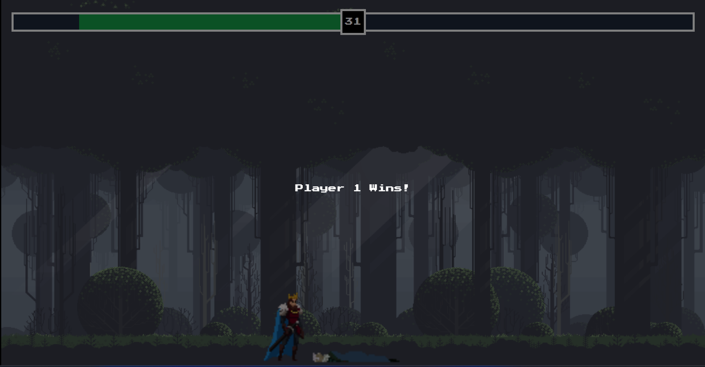

# Fighting Game

This 2D fighting game was built as my capstone project for my associate's degree in Advanced Computer Programming. I wanted to utilize what I already knew about web development and incorporate aspects of Object Oriented Programming.

## How To Play

Here's a demo!  

Player 1 controls the left character using the following keys:  
W - Jump  
A - Move left  
D - Move right  
Space Bar - Attack

Player 2 controls the right character using the following keys:  
Up Arrow - Jump  
Left Arrow - Move left  
Right Arrow - Move right  
Down Arrow - Attack

Try to outplay your opponent by landing attacks and dodging theirs. If you get your oppoenent's health bar to zero, you win!

## Deployment

This project is currently deployed at https://rssebastian-fighting-game.netlify.app/

## Update Ideas

(in no particular order)

- Add responsiveness so the canvas can render to different screen sizes
- Add a welcome menu that displays the controls for the game (currently it assumes two people are playing on the same keyboard)
- Add some AI that allows a player to play on their own
- Add in a websocket so a player can join either side from a different computer

## Tech Stack

HTML, SASS, JavaScript, Webpack
